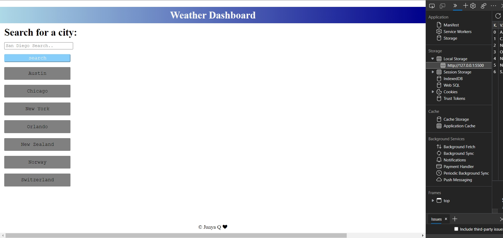
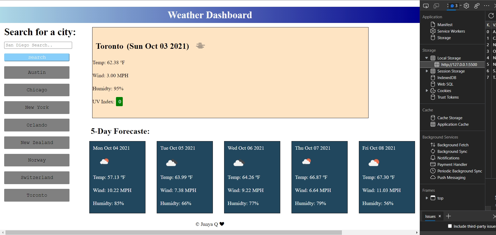

# bootcamp-challenge-06-weatherAPI
This is a website connected with a service side API, and will give dynamic result based on the API 
WHEN open the webpage 
THEN showing a list of previous searched result (won't show anything if never use the browser to do any search before) 
AND showing a blank input space on the left top corver and search button 

WHEN type in a valid city and click the search button  
THEN showing the current weather at the top large box 
AND five days forecastes under the large box 

FOR the current weather box 
SHOWING city name (same as searching),date, icon represents the weather, temperature in F, wind speed in MPH, humidity and UV index<br.>

WHEN viewing the UV index, it has its own background color 
WHEN UV index <3, showing green, 
WHEN UV index between 3-4.99, showing yellow, 
WHEN UV index between 5-6.99, showing orange  
WHEN UV index between 7-9.99, showing red 
WHEN UV index larger than 10, showing violet 

FOR the 5 days forecastes 
SHOWING the date, icon represents the weather, temperature in F, wind speed in MPH, humidity 

WHEN search a new city  
THEN the city name will be saved in local sotrage, and have a lsit of history buttons under the search button 

WHEN search a city that already searched before (already saved in the history before) 
THEN it won't be saved for a second time in the local storage.  

WHEN clicked on to each city in searched histories  
THEN it shows the weather of the city 

The main page  
 
Result page after search  
 

Deployed URL: https://junyaq.github.io/bootcamp-challenge-weatherAPI/
